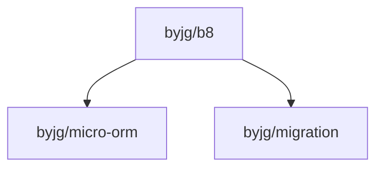

# b8 — Bayesian Text Classifier

[](https://github.com/sponsors/byjg)
[](https://github.com/byjg/b8/actions/workflows/phpunit.yml)
[](http://opensource.byjg.com)
[](https://github.com/byjg/b8/)
[](https://opensource.byjg.com/opensource/licensing.html)
[](https://github.com/byjg/b8/releases/)

A PHP library for statistical text classification. Provides two independent engines:

- **B8** — Binary Robinson-Fisher Bayesian filter. Classifies text as spam or ham, returning a probability score between `0.0` (ham) and `1.0` (spam). Designed for high-accuracy two-class filtering with word degeneration support.
- **NaiveBayes** — Multi-class Naive Bayes classifier. Classifies text into any number of user-defined categories, returning a ranked score map. Suitable for language detection, topic tagging, content routing, and similar tasks.

Both engines share the same tokenization pipeline (`StandardLexer`, `StandardDegenerator`) and support pluggable storage backends (in-memory, SQLite, MySQL, PostgreSQL, BerkeleyDB).

## Installation

```bash
composer require byjg/b8
```

Requires PHP `>=8.3`. The BerkeleyDB storage backend additionally requires `ext-dba`.

## Quick Example

**Spam filter:**

```php
use B8\B8;
use B8\ConfigB8;
use B8\Lexer\StandardLexer;
use B8\Lexer\ConfigLexer;
use B8\Degenerator\StandardDegenerator;
use B8\Degenerator\ConfigDegenerator;
use B8\Storage\Rdbms;
use ByJG\Util\Uri;

$storage = new Rdbms(new Uri('sqlite:///tmp/spam.db'), new StandardDegenerator(new ConfigDegenerator()));
$storage->createDatabase();

$b8 = new B8(new ConfigB8(), $storage, new StandardLexer(new ConfigLexer()));

$b8->learn('Buy cheap pills now!!!', B8::SPAM);
$b8->learn('Meeting at 3pm in the conference room', B8::HAM);

$score = $b8->classify('buy pills online cheap');
// $score is close to 1.0 (spam)
```

**Multi-class classifier:**

```php
use B8\NaiveBayes\NaiveBayes;
use B8\NaiveBayes\Storage\Memory;
use B8\Lexer\StandardLexer;
use B8\Lexer\ConfigLexer;

$nb = new NaiveBayes(new Memory(), new StandardLexer(new ConfigLexer()));

$nb->train('PHP is a programming language', 'tech');
$nb->train('The cat sat on the mat', 'animals');

$scores = $nb->classify('programming language');
// ['tech' => 0.93, 'animals' => 0.07]
```

## Documentation

| Section | Description |
|---|---|
| [Getting Started](docs/getting-started/installation.md) | Installation, requirements, first working example |
| [Guides: Spam Filter](docs/guides/spam-filter/training.md) | Training, classifying, choosing storage |
| [Guides: Multi-class](docs/guides/multi-class/training.md) | Training categories, classifying, persistence |
| [Concepts](docs/concepts/how-b8-works.md) | How the algorithms work, architecture overview |
| [Reference](docs/reference/b8.md) | Full API, configuration parameters, error codes |

## Acknowledgements

This library is inspired by the original **b8** spam filter written by [Tobias Leupold](mailto:tobias.leupold@web.de). The core algorithm, Robinson-Fisher probability model, token degeneration approach, and the `b8*` internal variable convention all originate from his work. This project modernises the codebase for PHP 8.3+, replaces the storage layer with `byjg/micro-orm` and `byjg/migration`, and adds a multi-class NaiveBayes engine built on the same tokenisation pipeline.

## Dependencies


