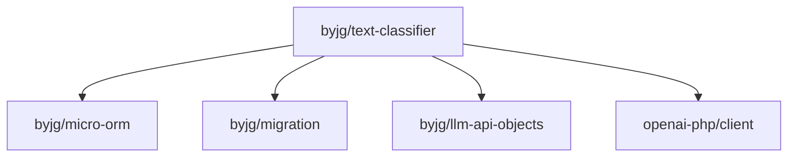

# text-classifier — Bayesian Text Classifier

A PHP library for statistical text classification. Provides two independent engines:

[](https://github.com/sponsors/byjg)
[](https://github.com/byjg/text-classifier/actions/workflows/phpunit.yml)
[](http://opensource.byjg.com)
[](https://github.com/byjg/text-classifier/)
[](https://opensource.byjg.com/opensource/licensing.html)
[](https://github.com/byjg/text-classifier/releases/)

A PHP library for statistical text classification. Provides two independent engines:

- **BinaryClassifier** — Binary Robinson-Fisher Bayesian filter. Classifies text as spam or ham. Designed for high-accuracy two-class filtering with word degeneration support.
- **NaiveBayes** — Multi-class Naive Bayes classifier. Classifies text into any number of user-defined categories. Suitable for language detection, topic tagging, content routing, and similar tasks.

Both engines return a `ClassificationResult` with the winning category, confidence score, and all category scores. Both support optional LLM injection for automatic escalation when the statistical model is uncertain — the LLM decision is fed back as training data, improving the model over time (active learning).

Both engines share the same tokenisation pipeline (`StandardLexer`, `StandardDegenerator`) and support pluggable storage backends (in-memory, SQLite, MySQL, PostgreSQL, GDBM).

## Installation

```bash
composer require byjg/text-classifier
```

Requires PHP `>=8.3`. The GDBM storage backend additionally requires `ext-dba`.

## Quick Example

**Spam filter:**

```php
use ByJG\TextClassifier\BinaryClassifier;
use ByJG\TextClassifier\ConfigBinaryClassifier;
use ByJG\TextClassifier\Lexer\StandardLexer;
use ByJG\TextClassifier\Lexer\ConfigLexer;
use ByJG\TextClassifier\Degenerator\StandardDegenerator;
use ByJG\TextClassifier\Degenerator\ConfigDegenerator;
use ByJG\TextClassifier\Storage\Rdbms;
use ByJG\Util\Uri;

$storage = new Rdbms(new Uri('sqlite:///tmp/spam.db'), new StandardDegenerator(new ConfigDegenerator()));
$storage->createDatabase();

$classifier = new BinaryClassifier(new ConfigBinaryClassifier(), $storage, new StandardLexer(new ConfigLexer()));

$classifier->learn('Buy cheap pills now!!!', BinaryClassifier::SPAM);
$classifier->learn('Meeting at 3pm in the conference room', BinaryClassifier::HAM);

$result = $classifier->classify('buy pills online cheap');
// $result->choice === 'spam'
// $result->score  is close to 1.0
```

**Multi-class classifier:**

```php
use ByJG\TextClassifier\NaiveBayes\NaiveBayes;
use ByJG\TextClassifier\NaiveBayes\Storage\Memory;
use ByJG\TextClassifier\Lexer\StandardLexer;
use ByJG\TextClassifier\Lexer\ConfigLexer;

$nb = new NaiveBayes(new Memory(), new StandardLexer(new ConfigLexer()));

$nb->train('PHP is a programming language', 'tech');
$nb->train('The cat sat on the mat', 'animals');

$result = $nb->classify('programming language');
// $result->choice          === 'tech'
// $result->score           === 0.93
// $result->scores          === ['tech' => 0.93, 'animals' => 0.07]
```

## Documentation

| Section | Description |
|---|---|
| [Getting Started](getting-started/installation) | Installation, requirements, first working example |
| [Guides: Spam Filter](guides/spam-filter/training) | Training, classifying, choosing storage |
| [Guides: Multi-class](guides/multi-class/training) | Training categories, classifying, persistence |
| [Guide: LLM-Assisted Classification](guides/llm-assisted-classification) | Automatic LLM fallback and active learning |
| [Concepts](concepts/how-binary-classifier-works) | How the algorithms work, architecture overview |
| [Reference](reference/binary-classifier) | Full API, configuration parameters, error codes |

## Acknowledgements

This library is inspired by the original **b8** spam filter written by [Tobias Leupold](mailto:tobias.leupold@web.de). The core algorithm, Robinson-Fisher probability model, token degeneration approach, and the `tc*` internal variable convention all originate from his work. This project modernises the codebase for PHP 8.3+, replaces the storage layer with `byjg/micro-orm` and `byjg/migration`, and adds a multi-class NaiveBayes engine built on the same tokenisation pipeline.

## Dependencies


